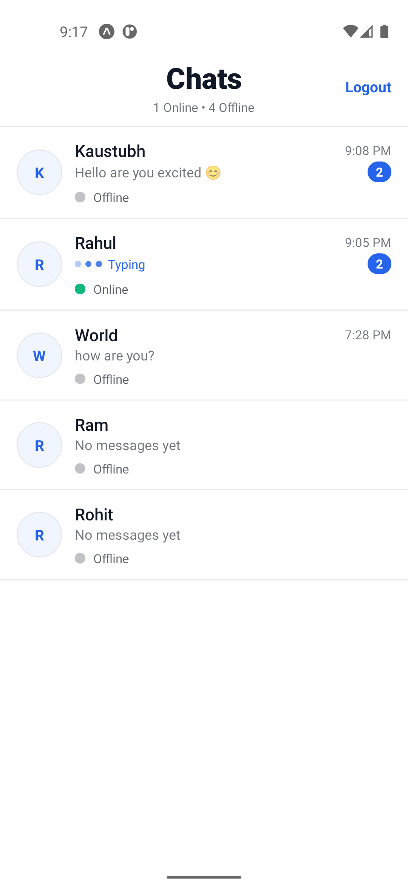
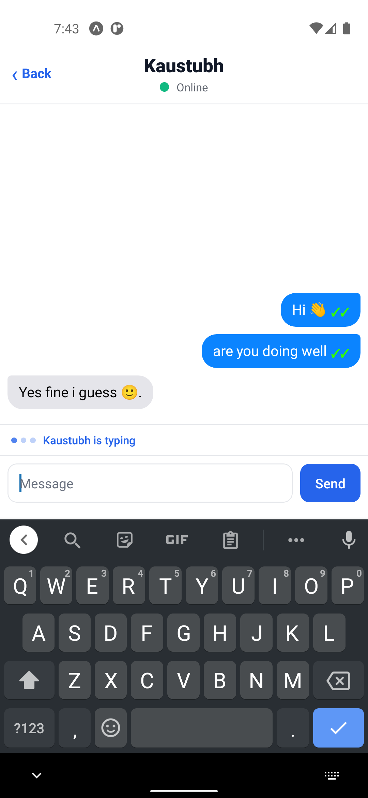
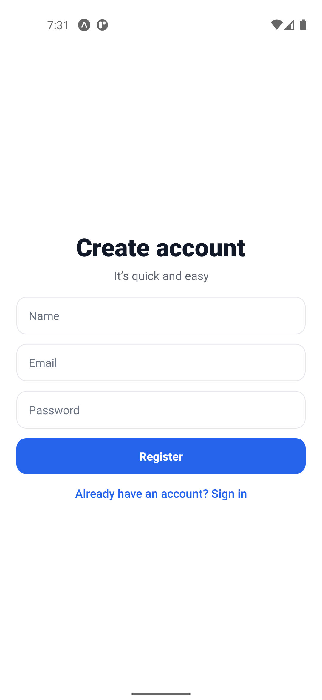

# Real-time Chat Application

A real-time chat application built with React Native (Expo) for the frontend and Express.js + Socket.IO for the backend.
This project demonstrates user authentication, live messaging, and seamless real-time updates between connected clients.

## Demo

[](https://www.youtube.com/watch?v=7CfUTtmJ0wg)

## Screenshots

| Home | Chat | Login | Register |
|-------|---------|------|------|
|  |  |  |  |

## Features

- 📱 **Cross-platform mobile app** with React Native (Expo)
- ⚡ **Realtime messaging** powered by Socket.IO
- 🔐 **Authentication** system
- 📡 **Express** backend with API + **WebSocket** support
- 🖼️ **Clean** and **modern** UI


## Installation

Clone the repository:

```bash
  git clone https://github.com/kaustubh010/RealTime-Chat-Application.git
  cd RealTime-Chat-Application
```

Backend Setup:

```bash
  cd Backend
  npm install
  npm run start
```

Frontend Setup:

```bash
  cd Frontend
  npm install
  npm expo start
```
    
## Environment Variables

To run this project, you will need to add the following environment variables to your .env file in the Backend Folder.

`JWT_SECRET`

`MONGODB_URI`

Also specify where the Backend is running in the Frontend constants.js file.

`BACKEND_URL`

## API Reference

#### Get current user info

```http
  GET /auth/me
```

#### Get all users with chat information

```http
  GET /auth/users
```

#### Register user

```http
  POST /auth/register
```

#### Login user

```http
  POST /auth/login
```

#### Get all messages between current user and another user

```http
  GET /message/:otherUserId
```

| Parameter | Type     | Description                       |
| :-------- | :------- | :-------------------------------- |
| `currentUserId`      | `string` | Id of the current user |

#### Mark messages as read

```http
  POST /message/:otherUserId/mark-read
```

| Parameter | Type     | Description                       |
| :-------- | :------- | :-------------------------------- |
| `currentUserId`      | `string` | Id of the current user |

## Tech Stack

**Frontend:** React-Native, Expo

**Backend:** Node, Express, Socket.io, mongodb


## Author

- [@kaustubh010](https://www.github.com/kaustubh010)